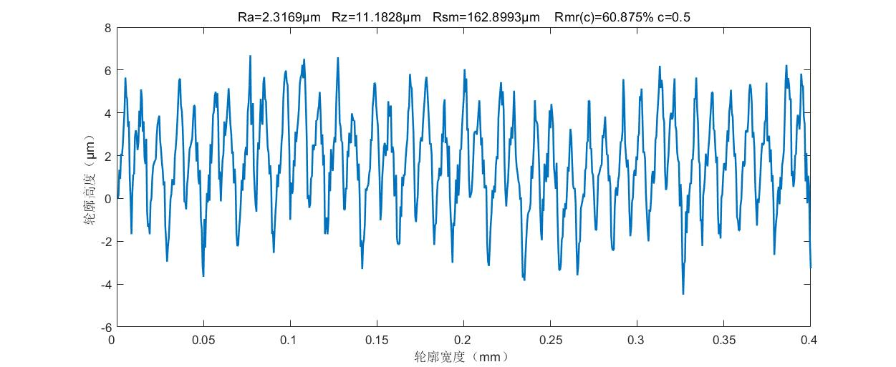

# **互换性实验数据处理**

`仅供大家学习交流使用，如果对你有帮助的话，记得star一下哈哈哈`

***
## **2-1直线度测量**
分为最小二乘法计算和端点法计算，这个代码主要是从CSDN上改的。

### 1.最小二乘法计算
MATLAB文件见 [二乘法.m](erchengfa.m)，计算结果如下所示

### 2.端点法计算
MATLAB文件见 [端点法.m](duandianfa.m)，计算结果如下

***
## **3-2表面粗糙度计算**
  实验原始数据采用的是[1-1](四个工件的原始高度数据采样长度0.8/1-1t.txt)，MATLAB文件见[Ra3_2.m](../Ra3_2.m)，我比较懒，三个模块写在一个脚本里在，运行的时候可以设置断点依次生成三个图。数据处理结果如下所示：
- ### 1.原始轮廓

- ### 2.滤波后的表面轮廓(伪)以及相关R值的计算

- ### 3.支撑长度率曲线图

***
## **4-4齿轮径向误差计算**
MATLAB文件见[齿轮4_4](gear4_4.m),计算结果如下

这个代码主要参考CSDN上的一篇[“径向综合总偏差与一齿径向综合偏差测量”数据处理](https://blog.csdn.net/qq_39460188/article/details/80230637)，我稍微做了些改动。

***
## **其他文件说明**
- 实验2-1的原数据是[mrq1110.txt](mrq1110.txt)
- 实验3-2的原数据是[Ra](四个工件的原始高度数据采样长度0.8/1-1t.txt)
- 实验4-4的原始数据是[4-4](10.18互换性实验齿轮双面啮合检查/20221018-1.txt)

` 2022.12.03`
